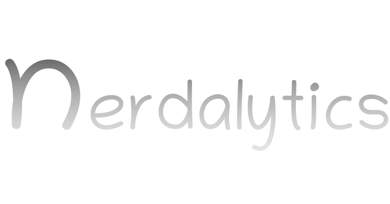

<!---
nerdalytics/nerdalytics is a ✨ special ✨ repository because its `README.md` (this file) appears on your GitHub profile.
You can click the Preview link to take a look at your changes.
--->
  
  
  
  

# 👋 Hi

*My true passion is DJing, although it was difficult to make a steady income at the start; this led me to become Lead Developer/Solution Architect at [@nexum](https://twitter.com/nexum).*

*Despite having several other passions—such as cycling, playing console games, drone piloting—I take solace in knowing that one day my dream of owning a Ford Mustang GT500 will come true!*

*My Packt book subscription helps keep me engaged throughout each day with its multitude of reading material.*

*Moreover, I am truly blessed to share my home with an incredibly lovable deaf kitty who lights up any room she enters!*

  

